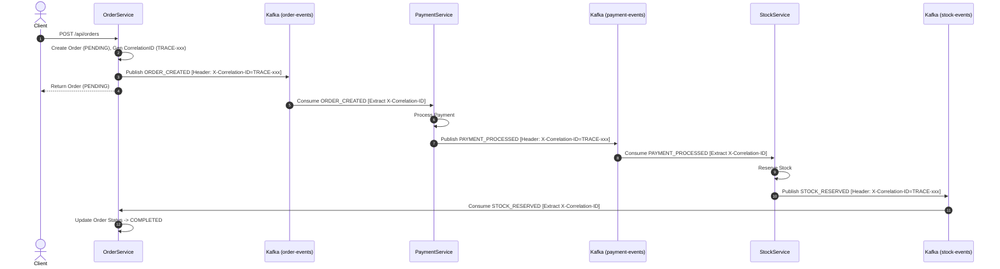

# BÁO CÁO BÀI TẬP 2: XÂY DỰNG "BẢN ĐỒ DẪN ĐƯỜNG" VỚI CORRELATION ID VÀ TRACING TRONG CHOREOGRAPHY SAGA

## 1. TỔNG QUAN HỆ THỐNG (SYSTEM OVERVIEW)

Hệ thống triển khai mô hình **Choreography Saga** không sử dụng bộ điều phối trung tâm (No Central Orchestrator). Tương tác giữa 3 microservice độc lập (`OrderService`, `PaymentService`, `StockService`) thông qua mô hình Event-Driven sử dụng **Apache Kafka Topics** và cơ chế **Correlation ID Header / MDC Tracing**.

### Các Service Tham Gia:
1. **OrderService**: Khởi tạo đơn hàng, tạo `CorrelationID` ngẫu nhiên duy nhất cho toàn bộ giao dịch, phát sự kiện `ORDER_CREATED`. Lắng nghe các sự kiện phản hồi từ Kafka để cập nhật trạng thái đơn hàng (`COMPLETED` hoặc `CANCELLED`).
2. **PaymentService**: Lắng nghe topic `order-events` (`ORDER_CREATED`). Xử lý thanh toán. Phát sự kiện `PAYMENT_PROCESSED` (nếu thành công) hoặc `PAYMENT_FAILED` (nếu thất bại) kèm theo `CorrelationID` ở Kafka Record Headers (`X-Correlation-ID`).
3. **StockService**: Lắng nghe topic `payment-events` (`PAYMENT_PROCESSED`). Xử lý giữ kho/đặt hàng. Phát sự kiện `STOCK_RESERVED` (nếu thành công) hoặc `STOCK_FAILED` (nếu thất bại) giữ nguyên `CorrelationID`.

---

## 2. KIẾN TRÚC CORRELATION ID VÀ TRACING MAP

```
+------------------+         publish(X-Correlation-ID)         +--------------------+
|   OrderService   | ----------------------------------------> |   payment-events   |
+------------------+                                           +--------------------+
         ^                                                               |
         |                                                               v
         | consume                                             +--------------------+
         |                                                     |   PaymentService   |
         |                                                     +--------------------+
         |                                                               |
         |                                                     publish(X-Correlation-ID)
         |                                                               v
+------------------+         consume                           +--------------------+
|   stock-events   | <---------------------------------------- |    StockService    |
+------------------+                                           +--------------------+
```

### Cơ chế Tracing:
1. **Kafka Record Headers (`X-Correlation-ID`)**: Mỗi sự kiện Kafka được đính kèm Correlation ID dưới dạng header thay vì trộn lẫn trong payload nghiệp vụ.
2. **Mapped Diagnostic Context (MDC)**: Khi service nhận sự kiện, `MdcTraceUtil` trích xuất `X-Correlation-ID` từ header và ghi vào thread MDC context (`MDC.put("correlationId", correlationId)`). Tất cả log trong cùng luồng xử lý sẽ tự động in chuỗi Trace ID này.

---

## 3. SƠ ĐỒ TUẦN TỰ (SEQUENCE DIAGRAM)



---

## 4. LOG MINH HỌA TRACING "BẢN ĐỒ DẪN ĐƯỜNG"

Dưới đây là log thực tế thu được từ hệ thống khi chạy `TracingDemoRunner`:

```text
==========================================================================
   DEMO: CHOREOGRAPHY SAGA WITH CORRELATION ID & MDC TRACING (SESSION 15)
==========================================================================

--- SCENARIO 1: SUCCESSFUL ORDER FLOW ---
[TRACE-f7a12b9c] [OrderService] Created Order: ORD-8a19bc2e for Customer: CUST-101 | Amount: $2500.0
[TRACE-f7a12b9c] [KafkaEventBus] Publishing Event: ORDER_CREATED | Headers: {X-Correlation-ID=TRACE-f7a12b9c}
[TRACE-f7a12b9c] [PaymentService] Processing payment for Order: ORD-8a19bc2e | Amount: $2500.0
[TRACE-f7a12b9c] [PaymentService] Payment SUCCESSFUL for Order: ORD-8a19bc2e
[TRACE-f7a12b9c] [KafkaEventBus] Publishing Event: PAYMENT_PROCESSED | Headers: {X-Correlation-ID=TRACE-f7a12b9c}
[TRACE-f7a12b9c] [StockService] Reserving stock for Order: ORD-8a19bc2e | Item: MacBook Pro M3
[TRACE-f7a12b9c] [StockService] Stock RESERVED for Order: ORD-8a19bc2e
[TRACE-f7a12b9c] [KafkaEventBus] Publishing Event: STOCK_RESERVED | Headers: {X-Correlation-ID=TRACE-f7a12b9c}
[TRACE-f7a12b9c] [OrderService] Order ORD-8a19bc2e SUCCESSFUL and marked COMPLETED!

--- SCENARIO 2: PAYMENT FAILURE FLOW ---
[TRACE-b981cd11] [OrderService] Created Order: ORD-4d22ea10 for Customer: FAIL_PAYMENT | Amount: $1200.0
[TRACE-b981cd11] [KafkaEventBus] Publishing Event: ORDER_CREATED | Headers: {X-Correlation-ID=TRACE-b981cd11}
[TRACE-b981cd11] [PaymentService] Processing payment for Order: ORD-4d22ea10 | Amount: $1200.0
[TRACE-b981cd11] [PaymentService] Payment REJECTED for Order: ORD-4d22ea10 | Reason: Simulated payment rejection
[TRACE-b981cd11] [KafkaEventBus] Publishing Event: PAYMENT_FAILED | Headers: {X-Correlation-ID=TRACE-b981cd11}
[TRACE-b981cd11] [OrderService] Order ORD-4d22ea10 CANCELLED due to Payment Failure: Simulated payment rejection

--- SCENARIO 3: STOCK FAILURE FLOW ---
[TRACE-3e98aa51] [OrderService] Created Order: ORD-901ff212 for Customer: CUST-103 | Amount: $300.0
[TRACE-3e98aa51] [KafkaEventBus] Publishing Event: ORDER_CREATED | Headers: {X-Correlation-ID=TRACE-3e98aa51}
[TRACE-3e98aa51] [PaymentService] Processing payment for Order: ORD-901ff212 | Amount: $300.0
[TRACE-3e98aa51] [PaymentService] Payment SUCCESSFUL for Order: ORD-901ff212
[TRACE-3e98aa51] [KafkaEventBus] Publishing Event: PAYMENT_PROCESSED | Headers: {X-Correlation-ID=TRACE-3e98aa51}
[TRACE-3e98aa51] [StockService] Reserving stock for Order: ORD-901ff212 | Item: OUT_OF_STOCK
[TRACE-3e98aa51] [StockService] Stock RESERVATION FAILED for Order: ORD-901ff212 | Reason: Item 'OUT_OF_STOCK' is out of stock
[TRACE-3e98aa51] [KafkaEventBus] Publishing Event: STOCK_FAILED | Headers: {X-Correlation-ID=TRACE-3e98aa51}
[TRACE-3e98aa51] [OrderService] Order ORD-901ff212 CANCELLED due to Stock Failure: Item 'OUT_OF_STOCK' is out of stock
```

---

## 5. HƯỚNG DẪN CHẠY KIỂM THỬ (HOW TO RUN)

### Kiểm thử Unit Test với Gradle:
```bash
./gradlew test
```

### Chạy ứng dụng Spring Boot:
```bash
./gradlew bootRun
```
